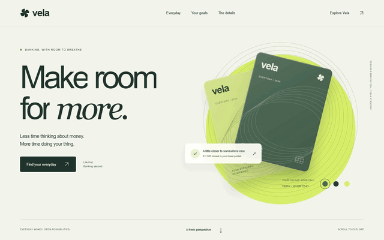
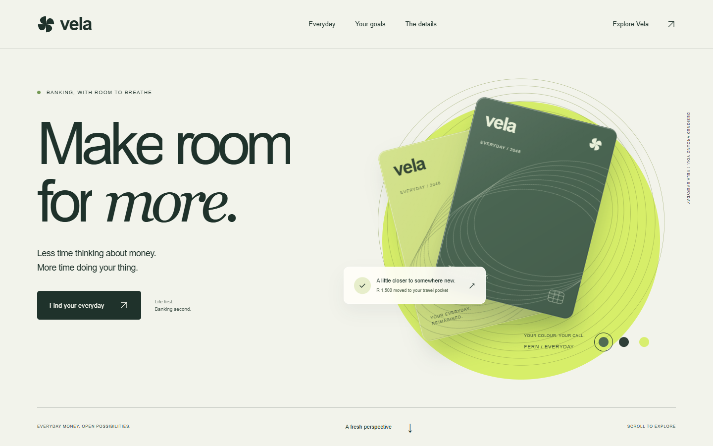
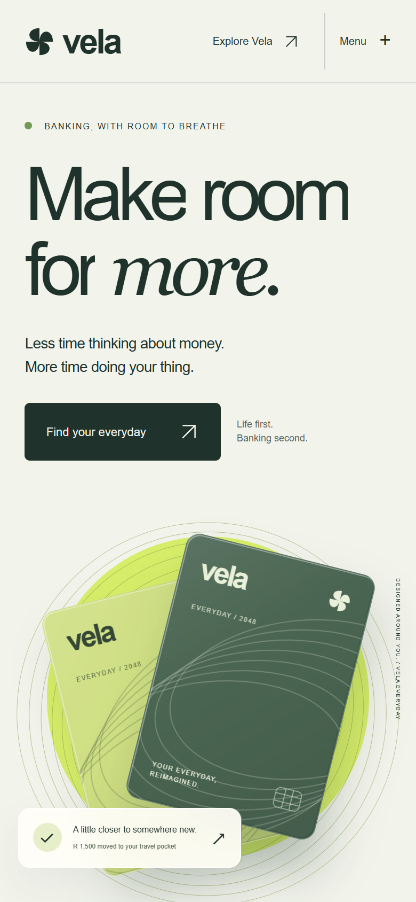

<p align="center"></p>

<p align="center">
  <a href="https://14-vela.williamking.workers.dev"></a>
  
  
  
  
  
  
</p>

**A fictional everyday-banking brand.** A confident graphic website with live card finishes, scroll-linked choreography, a three-chapter product tour and a savings planner that tells the truth about contributions.

<p align="center"></p>

## What you can do

- **Choose a card finish** and watch the artwork respond to your pointer and light.
- **Take the product tour** in three chapters, with a chapter dock that tracks your reading.
- **Plan savings** with a contributions-only calculator and goal milestones.
- **Compare plans**, preview the sample app in a guided dialog, and browse the FAQ.

## What's inside

- **Scroll-linked type, rings and card composition** choreographed with GSAP ScrollTrigger and SplitText.
- **A usable pause-card control**, an editable guided preview and a large moving typographic interlude.
- **Readable before JavaScript loads:** content is statically prerendered; interactive controls enhance it.
- **Care for motion and access:** a motion preference control, OS reduced-motion support, mobile navigation and zero axe violations in the final review.
- **Honest numbers:** every account, price and balance is fictional, and no personal data is collected.

## Screenshots

| Desktop | Phone |
| --- | --- |
|  |  |

## Built with

React, GSAP (ScrollTrigger, SplitText, DrawSVG), Tailwind CSS with Lightning CSS, TypeScript, Vite and Bun. No Three.js.

## Run it locally

```sh
bun install --frozen-lockfile
bun run dev      # http://127.0.0.1:4524/
bun run check    # strict TypeScript, Biome, domain tests and the prerendered build
bun run preview  # http://127.0.0.1:4624/ after bun run build
```

Design and verification: [DESIGN.md](DESIGN.md), [docs/visual/VERIFICATION.md](docs/visual/VERIFICATION.md) and the working history in [docs/PROJECT-NOTES.md](docs/PROJECT-NOTES.md).

## Credits

Original art and code; sources and licences for anything else are in [CREDITS.md](CREDITS.md) and [assets.manifest.json](assets.manifest.json). VELA is not a real bank.

---

<p align="center"><sub>Part of William King's portfolio collection.</sub></p>
