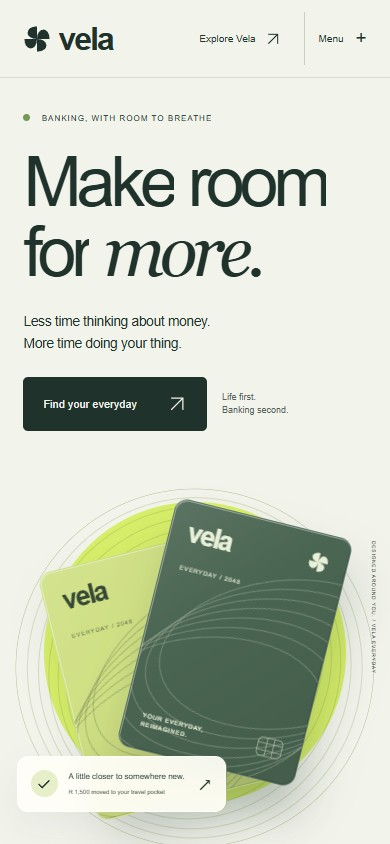
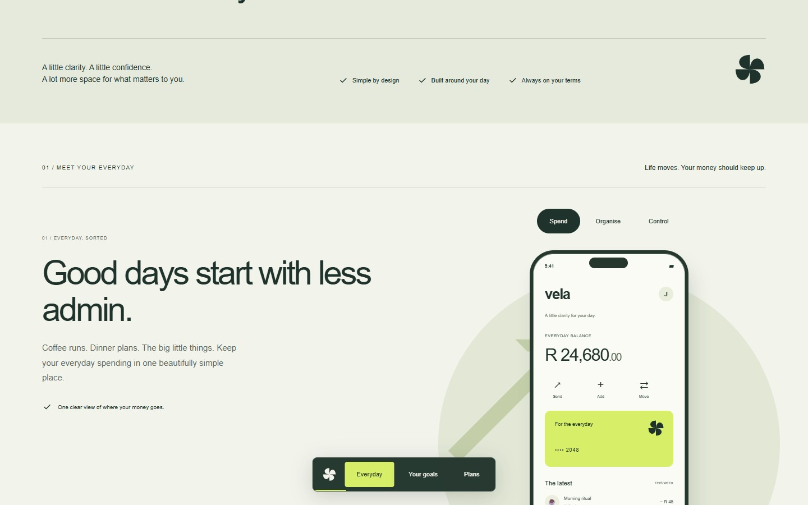

# VELA

<p align="center"></p>

A fictional everyday-banking website built around the things a visitor can try: change a card finish, explore a sample app, plan a savings goal and compare plans. Bold type, a moving card composition and scroll-linked chapters give the product a distinct visual identity.

**[Explore VELA →](https://14-vela.williamking.workers.dev)** · [Run locally](#run-locally) · [Credits](#credits)

<p align="center"></p>

## Try the product story

- **Choose a card finish.** The hero card responds to the pointer and changes its surface treatment. Pause the moving card when you want to inspect it.
- **Explore three product chapters.** A reading dock tracks progress through the tour. Sample app tabs let you inspect the product states rather than only reading about them.
- **Build a savings goal.** Change the starting amount, monthly contribution and goal. The chart and milestones show contributions only: no invented interest, investment growth or guaranteed return.
- **Compare plans.** Inspect the fictional plan costs and open a guided preview. Review a choice, edit it and return without losing the work in the dialog.
- **Read the details.** Native FAQ controls, mobile navigation and clear closing actions support the longer page.

This is a portfolio demonstration, not a bank. Accounts, balances, card products and prices are fictional. The preview does not open an account or send an application to a financial provider.

## Motion that supports the page

GSAP ScrollTrigger coordinates the card, rings, large typography and chapter changes. SplitText handles text entrances; DrawSVG supports graphic details. Animation is scoped to the React lifecycle through useGSAP, with cleanup when the view is removed.

The site retains native scrolling, visible keyboard focus and a skip link. Visitors can change the motion preference, and the OS reduced-motion preference is respected. The chapter dock yields while calculator fields have keyboard focus. Native dialogs support Escape and focus return, and the card has its own pause control.

## Frontend architecture

VELA uses React, strict TypeScript, GSAP and Tailwind with Lightning CSS. The artwork is made with HTML, CSS and SVG; there is no Three.js runtime, external photograph service or runtime font request. Static prerendering makes the core copy readable before JavaScript loads. Interactions enhance that page in the browser.

- [src/App.tsx](src/App.tsx): product chapters, card, calculator, plans and guided preview.
- [src/domain.ts](src/domain.ts): contribution and plan calculations.
- [src/motion.ts](src/motion.ts): shared motion behaviour.
- [tools/prerender.tsx](tools/prerender.tsx): static HTML output.
- [DESIGN.md](DESIGN.md): the visual and interaction brief.

## Recorded verification

The current application revision is `24f37f0`. The implementation review recorded **six domain tests / 19 assertions**, 25 browser regressions and ten refinement interaction checks. Final sampled desktop, mobile and dialog states had no browser errors or automated axe violations. Read [VERIFICATION.md](docs/visual/VERIFICATION.md) for viewports, checks and limitations. This is bounded browser evidence, not a blanket accessibility certification.

## Current screenshots

| Desktop | Phone |
| --- | --- |
|  |  |



The opening loop and three main screenshots were captured from the live site on **1 October 2026**, using Chrome on this workstation; the phone image is a 390 × 844 browser viewport. The animated preview is a short loop, not a full playthrough. [Capture details](docs/readme/capture.json).

## Run locally

Use **Bun 1.3.10** (the version pinned in `package.json`) and Node.js 22.12 or newer. From this repository:

```sh
bun install --frozen-lockfile
bun run dev      # http://127.0.0.1:4524/
bun run check    # strict types, Biome, unit tests and production build
bun run preview  # http://127.0.0.1:4624/ after the build
```

Development and preview are separate long-running commands; run one at a time or use separate terminals. `bun run build` writes the static production output to `dist/`. Dependencies and the lockfile are local to this project.

## Stack and release

React 19.3 · strict TypeScript · Vite 8.3 · GSAP 3.15 · Tailwind CSS 4.3 · Bun 1.3.10 · Biome. The public website is served by Cloudflare Workers. This README describes [application revision 24f37f0](https://github.com/WilliamHenryKing/14-vela/commit/24f37f0bbb670cebf9cd14a46f733595813082ac); the documentation refresh changes no application behaviour.

## Credits

Original art and code; sources and licences for anything else are in [CREDITS.md](CREDITS.md) and [assets.manifest.json](assets.manifest.json). VELA is not a real bank.

---

Part of [William King's portfolio collection](https://github.com/WilliamHenryKing).
